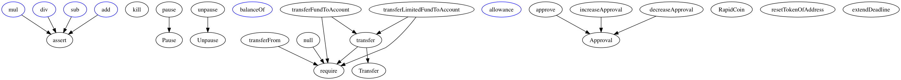

# Manual analysis of reports provided by tools

## Solhint

Highlighted issues provided by the [report](../report/solhint/report)  
 
#### RapidCoin.sol

We highlighted most important issues provided by the report from Solhint tool. All this issues need to be fixed 
except time-based decision issues. Time-based decisions should be checked in manual audit of the code.
Also we should pay attention at fallback methods because based on report it is too complex.  

| Line | Column | Message                                                     |
|------|--------|-------------------------------------------------------------|
| 1    | 17     | Compiler version must be fixed                              |
| 110  | 3      | Explicitly mark visibility of state                         |
| 229  | 5      | Explicitly mark visibility of state                         |
| 232  | 5      | Explicitly mark visibility of state                         |
| 233  | 5      | Explicitly mark visibility of state                         |
| 234  | 5      | Explicitly mark visibility of state                         |
| 235  | 5      | Explicitly mark visibility of state                         |
| 236  | 5      | Explicitly mark visibility of state                         |
| 246  | 28     | Avoid to make time-based decisions in your business logic   |
| 251  | 5      | Fallback function must be simple                            |
| 251  | 17     | Explicitly mark visibility in function                      |
| 253  | 17     | Avoid to making time-based decisions in your business logic |
| 254  | 17     | Avoid to making time-based decisions in your business logic |
| 256  | 12     | Avoid to making time-based decisions in your business logic |
| 260  | 17     | Avoid to making time-based decisions in your business logic |
| 262  | 24     | Avoid to making time-based decisions in your business logic |
| 269  | 17     | Avoid to making time-based decisions in your business logic |
| 277  | 14     | Variable result is unused                                   |


## Oyente security tool

[Oyente report](../report/oyente/report.html)  

Report provided assertion failures. Cases provided by report is covered 
by ```SafeMath``` library and no need to recheck this in manual audit.
  
## Solgraph

Based on Solgraph report we should pay attention at methods:
  - transferLimitedFundToAccount
  - transferFundToAccount   
  
This methods linked with transfer method which responsible to transfer fund to the address.       

[Solgraph report in .dot format](../report/solgraph/RapidCoin.dot)     
